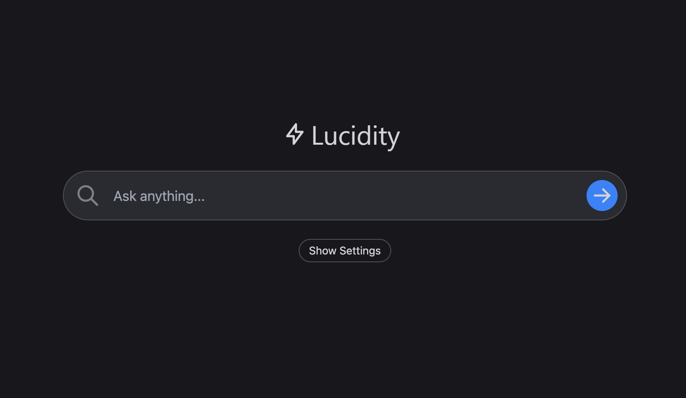

# Lucidity AI

Lucidity is an innovative application, inspired by [perplexity.ai](https://www.perplexity.ai/). The source code is available for you to use as per your needs!

## Have any Queries or Suggestions?

Should you have any queries or suggestions, feel free to reach out to me. [Email me here](mailto:ofunrein123@gmail.com)

(https://lucidity-ai.vercel.app/)

## Working Principle

Lucidity operates by taking a query, searching for the most relevant and current information on the web, and uses OpenAI's API to generate a response.

The functioning of the application is as follows:

1. Receives a query from the user.
2. Searches Google for relevant web pages.
3. Parses the text from the webpages.
4. Constructs a prompt using the query and the extracted text.
5. Utilizes OpenAI API to create a response.
6. Returns the response to the user.

## Pre-requisites

Acquire an OpenAI API key [here](https://openai.com/api/).

## Execution on Local Environment

1. Clone the repository

```bash
git clone https://github.com/Ofunrein/lucidity-ai.git
```

2. Install dependencies

```bash
npm i
```

3. Run the application

```bash
npm run dev
```

## Potential Improvements

Here are a few potential enhancements for Lucidity:

- [ ] Accelerate the response time by replacing link scraping with the Google Search API (scraping was a workaround to bypass cost and rate limits).
- [ ] Incorporate "follow-up" searches.
- [ ] Improve the prompt formulation.
- [ ] Enable compatibility with non text-davinci-003 models.
- [ ] Train a custom model for synthesizing responses.

## Acknowledgements

A big shoutout to [Perplexity AI](https://www.perplexity.ai/) for inspiring this project. I highly recommend exploring their product.

This repository shows that powerful applications like Perplexity can be built even without a large and experienced team.

LLMs are phenomenal, and I hope Lucidity motivates you to create something remarkable!
